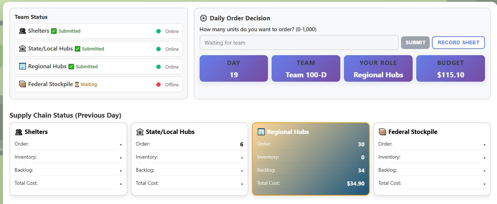

<!-- _class: lead -->
# Emergency Supply Chain Game
## How to Play

**[Yiseon Choi] | [choi.1908@osu.edu]**

---

# Task 

Flooding has disrupted the normal water supply, creating an urgent need at the Shelters to manage emergency water distribution effectively.

### Federal Stockpile -> Regional Hubs -> State/Local Hubs -> Shelters

Water moves **downstream** toward Shelters. Orders and requests move **upstream** toward the Federal Stockpile.

The urgent need starts at Shelters. In the first few days, upstream tiers may see little or no incoming demand while orders make their way through the chain. Use that time to understand your role, track your inventory, and prepare for orders to arrive.

> Use the information available to you to make the best order decision you can.

---

# The Four Tiers

| Tier | Main responsibility |
|---|---|
| Federal Stockpile | Supply water to Regional Hubs |
| Regional Hubs | Supply water to State/Local Hubs |
| State/Local Hubs | Supply water to Shelters |
| Shelters | Meet the people's demand for water |

Each person plays one tier. Your order becomes an incoming request for the tier above you. For every tier other than Shelters, the **downstream tier's order is the demand you need to fulfill**.

---

# Your Goal

Each game day, choose how many units of water to order.

You are balancing two competing risks:

- Order too little and unmet requests (demand) become **backorders**.
- Order too much and unused water remains as **inventory**.

Your aim as a team is to ensure Shelters have enough water to meet the people's demand.

---

# Step 1: Join the Game

1. Choose your assigned **Team Number** and **Team Letter**.
2. Select your assigned role.

---

# Step 2: Understand Lag

Orders and shipments do **not** arrive immediately.
A disaster can disrupt deliveries. If that happens, the lag may be **longer than usual**.

### Under normal conditions, the lag is 1 day for an order to travel upstream and 1 day for water to travel downstream.

Example: with a 1-day lag, if you order 1 unit of water in Day 1, it takes 1 day for the order information to travel upstream, and another 1 day for the water to travel downstream. Thus the water will arrive on Day 3.

---

# Step 3: Understand Cost

Costs are recorded at the end of every game day.

| Cost | How it is created |
|---|---|
| Inventory cost | $0.10 for each unit held in inventory at the end of the day |
| Backlog cost | $0.20 for each unit in backorder at the end of the day |
| Shared shortage cost | $0.50 charged to every team member each day that Shelters have any backlog |

### Total cost = Inventory cost + Backlog cost + Shared shortage cost

You receive **10% of your remaining budget** as your bonus payment.

### Bonus Payment = 10% of (Starting budget - Total cost)

For example, if your remaining budget is $70 at the end of the game, you receive $7. The lower your total cost, the more budget you have left and the higher your bonus payment.

---
# Step 4: Submit Your Order

Each day, every tier submits one order:

1. Enter an order from **0 to 1,000** units in the Daily Order Decision field.
2. Select **SUBMIT**.
3. Confirm that your order is recorded, then wait for the other tiers to submit.

Your submitted order is final for that game day. When everyone has submitted, the next day appears automatically and the order box opens for your next entry.

---

<!-- footer: Emergency Supply Chain Game | Game Tutorial -->
# Game Screen

---

<!-- footer: Emergency Supply Chain Game | Game Tutorial -->
# Reading the Game Screen

| Area | What to use it for |
|---|---|
| Message at the top | Shelters see today's demand; flooding notices appear when relevant. |
| Team Status | Check which tiers have submitted and whether teammates are online. |
| Daily Order Decision | Enter and submit your order for the current day. |
| Day, Team, Role, Budget | Confirm your current game status and remaining budget. |
| Supply Chain Status | Review the **previous day's** order, inventory, backlog, and cost. |

The **Record Sheet** provides your full day-by-day history. Scroll within it to review earlier days; do not refresh the page.

---

# Example

Use the **Record Sheet** to review what happened on previous game days. Do **not** refresh the page; scroll down in the Record Sheet to see additional days.

| Day | Demand | Order | Arrived | Shipped | Inventory | Backlog |
|---:|---:|---:|---:|---:|---:|---:|
| 1 | 8 | 4 | 0 | 8 | 0 | 0 |
| 2 | 4 | 5 | 0 | 0 | 0 | 4 |
| 3 | 4 | 10 | 3 | 3 | 0 | 5 |
| 4 | 4 | 15 | 9 | 9 | 0 | 0 |

---
<!-- _class: lead -->
## Questions before we start?

# Step 5: Complete the Trial
We will go through the short trial together before the full game begins.

# Step 6: Play the Game

When you reach the end screen, do not restart the game or close the page. Wait for the facilitator's next instruction.

